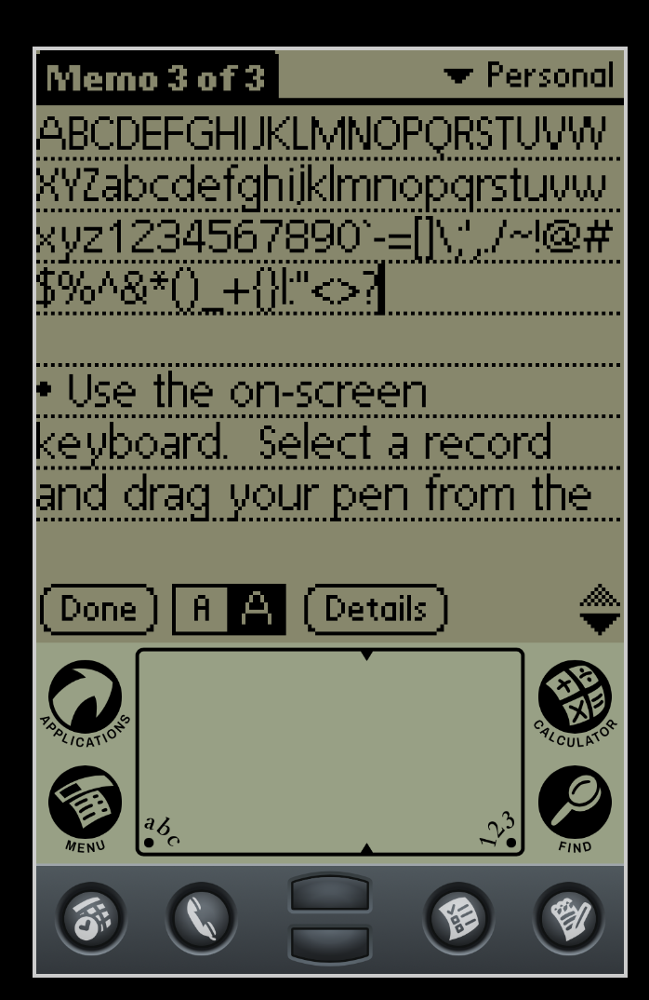

Pilot

This is a pixel typeface based off a few screenshots of a Palm Pilot I saw and appreciated.

In a similar vein to Tenori, my other pixel clone, I'm "extrapolating" from the limited set of characters available from images of the hardware into a full-fledged unicode-complete typeface, complete with stylistic sets, math symbols, and the works.
